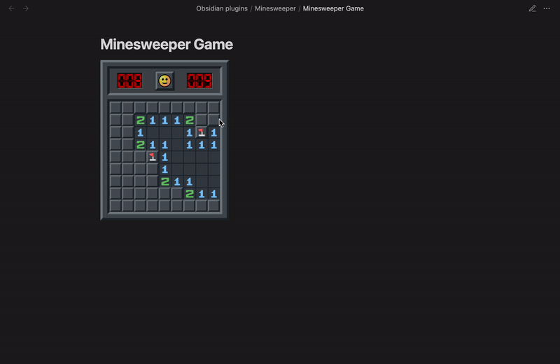

# Minesweeper in Obsidian

Enjoy the classic Minesweeper game directly in Obsidian!

## Why Minesweeper?
I created this plugin because it was fun to develop, and I know you'll enjoy playing it too! Whether you're offline or just looking to pass the time, Minesweeper is a perfect way to do it.

## Features
- A fun way to pass the time right within Obsidian.

# Usage

1. Install the Plugin:
    - Once available, you can install it from the Obsidian plugin marketplace. Alternatively, download the latest release, unzip it, place the folder in your vault's plugin directory, and enable it in Obsidian's settings.

2. Insert a Code Block:
    - Add a code block with `mnswpr` as language:
      ```
          ```mnswpr
          ```
      ```
3. Set Difficulty:
    - You can choose diffuclty by adding `dif: ...` inside code block. E.g:
      ```
          ```mnswpr
          dif: easy
          ```
      ```

## Demo
Check out a demo of the game in action:



## Contributing
Contributions are welcome! If you have suggestions for improvements or new features, please open an issue or submit a pull request.

## License
This project is licensed under the MIT License